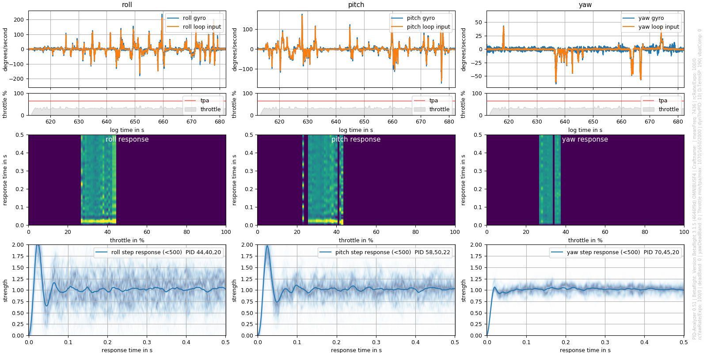
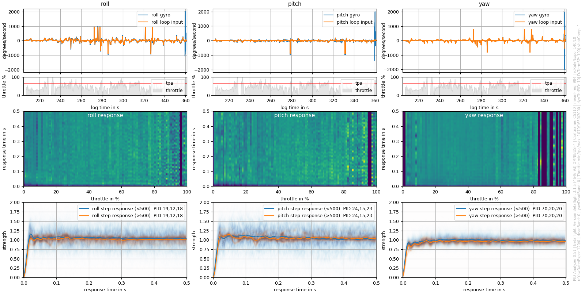

# pid_tune

This program reads Betaflight blackbox logs and calculates the PID step response. It is made as a tool for a more systematic approach to PID tuning.

## Introduction

The step response is a characteristic measure for PID performance and often referred to in tuning techniques.
For more details read: https://en.wikipedia.org/wiki/PID_controller#Manual_tuning
The program is Python based and use only Orangebox library to decode the blackbox. Blackbox_decode.exe is no more necessary here !

Tested with betaflight 4.2.8

As an example:
This was the BF 3.15 stock tune (including D Setpoint weight) on my 2.5" CS110:

This a nice tune I came up with after some testing:

You can even use angle mode, the result should be the same!
The program calculates the system response from input (PID loop input = What the quad should do) and output (Gyro = The quad does).
Mathematically this is called deconvolution, which is the invers to convolution: Input * Response = Output.
A 0.5s long response is calculated from a 1.5s long windowed region of interest. The window is shifted roughly 0.2s to calculate each next response.
From a mathematical point of view this is necessary, but makes each momentary response correspond to an interval of roughly +-0.75s.

Any external input (by forced movement like wind) will result in an incomplete system and thus in a corrupted response.
Based on RC-input and quality the momentary response functions are weighted to reduces the impact of corruptions. Due to statistics, more data (longer logs) will further improve reliability of the result.

If D Setpoint Transition is set in Betaflight, your tune and thus the response will differ for high RC-inputs.
This fact is respected by calculating separate responses for inputs above and below 500 deg/s. With just moderate input, you will get one result, if you also do flips there will be two.

Keep in mind that if you go crazy on the throttle it will cause more distortion.  If throttle-PID-attenuation (TPA) is set in Betaflight there will be a different response caused by a dynamically lower P.
This is the reason why the throttle and TPA threshold is additionally plotted.

The whole thing is still under development and results/input of different and more experienced pilots will be appreciated!

## Website

https://github.com/apiou/pid_tune

## Authors

Stéphane Apiou < stephane at apiou dot org >

## Copyright

2021 Stéphane Apiou

## License

BSD License

Orangebox is covered by LPGL License

See [License File](LICENSE)

## Remarks

This  program was primarily tested on linux x64 platform.
